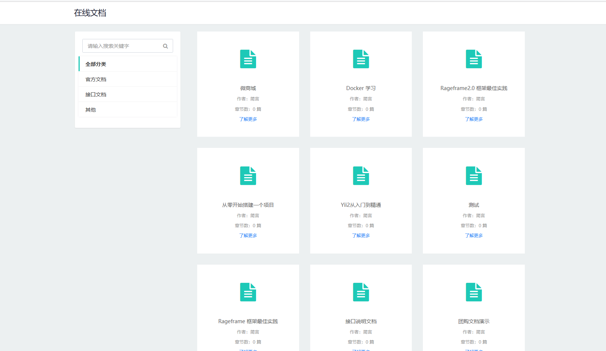
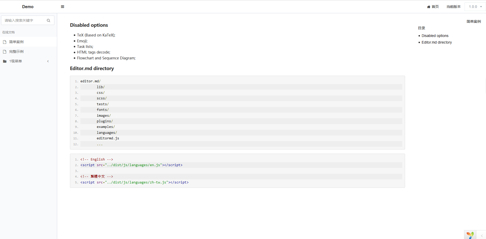
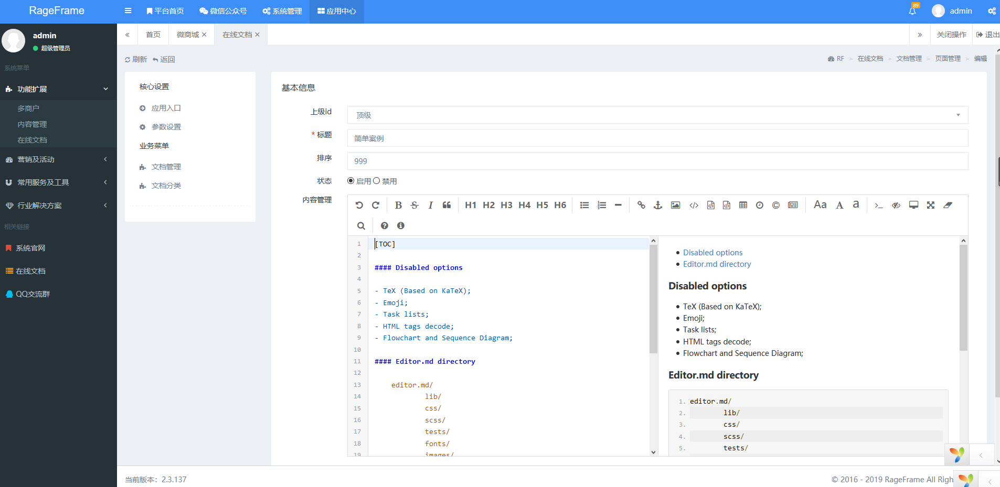
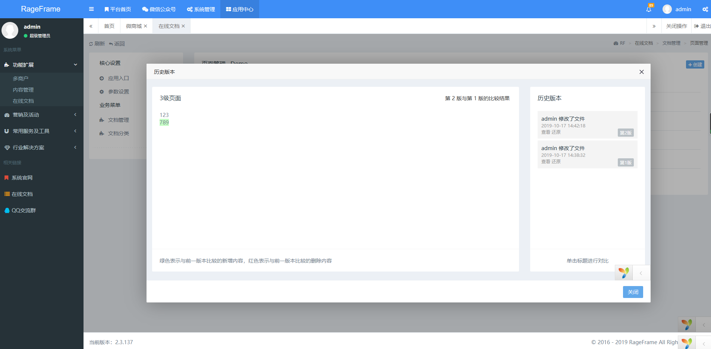

## 在线文档

属于开发者自己的文档

### 前言

基于 [RageFrame2](https://github.com/jianyan74/rageframe2) 的一款免费开源的插件

目前主要包含以下功能

- Markdown 章节编辑
- 百度编辑器章节编辑
- 文档管理
- 系列文档
- 文档 IP 地址限制访问
- 文档历史记录
- 文档差异对比
- 文档历史数据还原
- 文档编辑自动保存
- 图片(截图)黏贴上传
- 多人协作编辑友好提醒
- 模板管理/插入

### 功能快照

【首页】


【详情】


【编辑】


【历史版本】


### 安装

1、安装 RageFrame (2.4.0以上)

项目介绍：https://github.com/jianyan74/rageframe2

安装文档：https://github.com/jianyan74/rageframe2/blob/master/docs/guide-zh-CN/start-installation.md

2、克隆当前项目

```
git clone https://github.com/jianyan74/RfOnlineDoc.git
```

3、拷贝进 RageFrame 根目录的 addons 目录下

4、RageFrame 后台进入 系统管理->应用管理->安装插件->找到在线文档进行安装

5、刷新整个后台页面后进入 应用中心->功能扩展->在线文档 进行查看